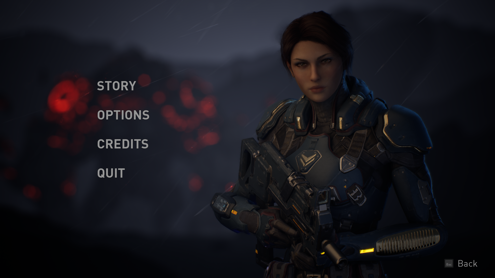
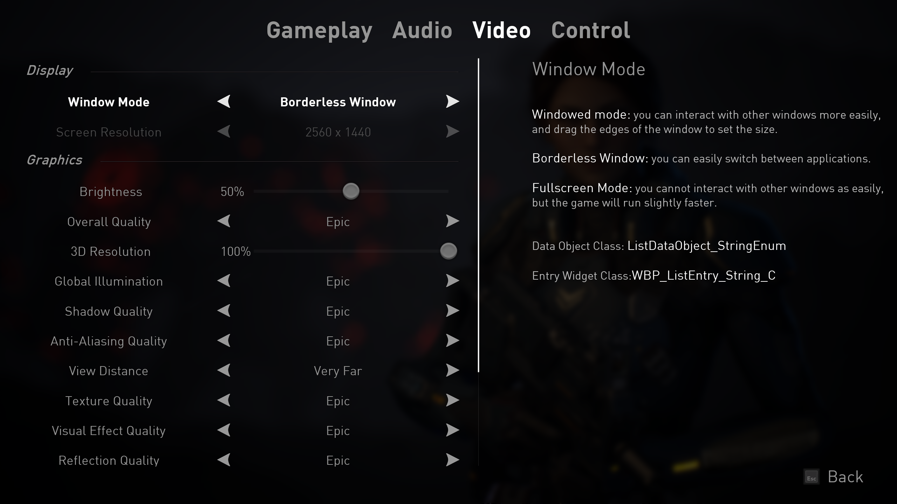

# UE5 Front-End Architecture Framework

A modular, C++-driven front-end UI architecture built for Unreal Engine 5.

This project focuses on clean separation of concerns, scalability, and reusable UI systems rather than visual asset presentation. It demonstrates a structured approach to building maintainable game front-end systems using UMG, Subsystems, and Gameplay Tags.

  

  

---

## 🎯 Design Goals

- Decouple UI logic from gameplay systems
- Promote reusable widget abstractions
- Support scalable menu flows
- Centralize state management
- Enable data-driven options architecture
- Provide clean controller-to-widget communication

---

## 🏗 Architecture Overview

### Core Layers

**GameInstance / Subsystem Layer**
- `FrontEndUISubsystem`
- Centralized UI state coordination
- Lifecycle management for screens

**Controller Layer**
- `FrontEndPlayerController`
- Input routing and screen transitions

**Widget Abstraction Layer**
- `Widget_PrimaryLayout`
- `Widget_ConfirmScreen`
- `Widget_ActivatableBase`
- Component-based common widgets

**Options System**
- Data-driven configuration
- `ListDataObject_*` abstractions
- Registry-based option handling
- Scalable entry mapping

**Common UI Components**
- `FrontEndCommonButtonBase`
- `FrontEndCommonListView`
- `FrontEndCommonRotator`
- Tab and list widget bases

---

## 🧠 Architectural Principles

- Composition over inheritance where possible
- Explicit subsystem ownership
- Data objects for UI-driven configuration
- Strong typing via structured data types
- Minimal coupling between view and logic layers

---

## 📂 Repository Structure

Content assets are intentionally excluded in this portfolio build to focus on architectural design rather than asset delivery.

---

## 🛠 Technologies Used

- Unreal Engine 5
- C++
- UMG
- Gameplay Tags
- Subsystems Architecture

---

## 📌 Purpose

This repository serves as a portfolio demonstration of modular front-end architecture patterns in Unreal Engine rather than a full playable demo.

---

MIT License
